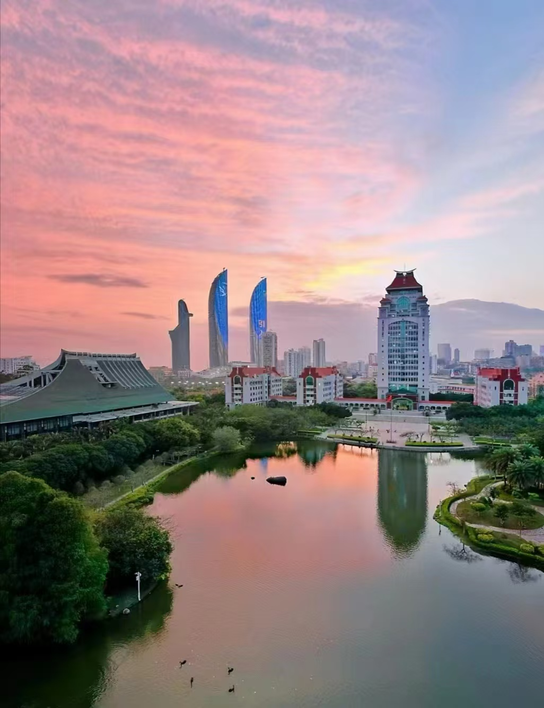

# ImageMesh

**ImageMesh** is a tool that generates colorful simplicial mesh images from input pictures. It applies the **Longest-edge bisection** algorithm to refine meshes and creates visually appealing outputs.

## Features

- Mesh refinement using the **Longest-edge bisection** algorithm.
- Outputs colorful triangular mesh images.
- Built with [Gridap](https://gridap.github.io/Tutorials/stable/) for mesh processing and [CairoMakie](https://docs.makie.org/stable/explanations/backends/cairomakie.html) for visualization.


## Installation

```julia
using Pkg 
Pkg.add(path="https://github.com/DimhamT/ImageMesh.jl.git")
```

## Usage

```julia
using ImageMesh
infile = "path/to/image"
outfile = "path/to/image"
img2mesh(infile, outfile)
```

## Example 

### Input Image



### Generated Mesh Output


## Notes

This is purely a toy project for fun and experimentation. Enjoy!